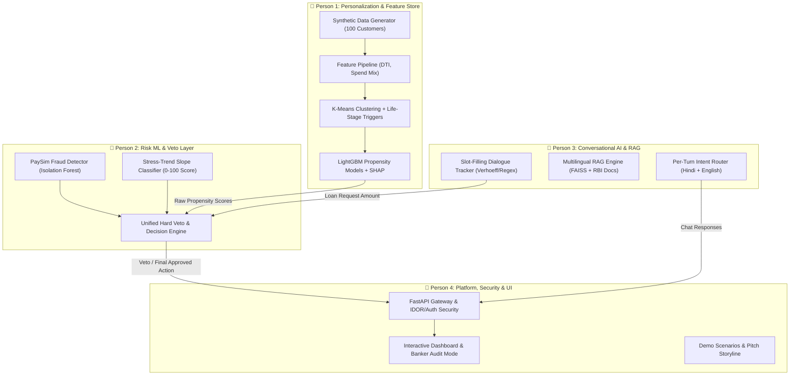

# BharatBanker AI: Team Distribution, Responsibilities & Deliverables (Team of 4)

> **Hackathon Theme:** Digital Transformation in Lending  
> **Core Architecture:** Unified Decisioning Platform for Hyper-Personalization, Vernacular Conversational Banking, and Empathetic Fraud/Financial Stress Detection.  
> **Primary Reference Document:** [`BharatBanker_AI_Unified_Solution.pdf`](file:///c:/Users/pushk/OneDrive/Desktop/Hackout/docs/BharatBanker_AI_Unified_Solution.pdf)  
> **Secondary References:** [`approach_problem1.md`](file:///c:/Users/pushk/OneDrive/Desktop/Hackout/docs/approach_problem1.md), [`hackathon-technical-report.pdf`](file:///c:/Users/pushk/OneDrive/Desktop/Hackout/docs/hackathon-technical-report.pdf), and Application Security Guidelines ([`Security portion of the program (1).docx`](file:///c:/Users/pushk/OneDrive/Desktop/Hackout/docs/Security%20portion%20of%20the%20program%20(1).docx)).

---

## 1. Executive Overview & Guiding Philosophy

BharatBanker AI is not a set of three siloed features—it is a **single, unified decisioning platform** that tackles the hackathon’s three core sub-problems together:

1. **Sub-Problem 1:** Proactive Hyper-Personalized Banking Recommendation Engine.
2. **Sub-Problem 2:** Vernacular-First Conversational AI (Dual Engine: Slot-Filling + RAG).
3. **Sub-Problem 3:** Empathetic Fraud & Financial Stress Detection.

### The Winning Differentiator: Decision Discipline & Ethical Veto

Judges frequently penalize solutions that appear as generic upselling tools. Our core technical edge is the **Unified Cross-Cutting Veto Layer**:

- If a customer exhibits financial stress or a debt-to-income (DTI) ratio exceeding $50\%$, **credit product recommendations are blocked by a deterministic hard rule** across all touchpoints (both app dashboards and conversational loan journeys).
- The system replaces predatory upsells with **empathetic interventions** (EMI rescheduling, debt counselling, budgeting nudges).
- Every recommendation is explainable (**SHAP-based plain-language explanations**), and every vernacular conversational answer is grounded in cited regulatory sources (**RBI / PMJDY / NPCI**).

---

## 2. High-Level Team Distribution Matrix



| Member | Role Title | Sub-Problems Owned | Primary Tech Stack | Core Hackathon Mission |
| --- | --- | --- | --- | --- |
| **Person 1** | **ML & Personalization Lead** | Sub-Problem 1 & Shared Feature Store | Python, Pandas, Scikit-learn, LightGBM, SHAP | Build the synthetic 100-customer feature pipeline, K-Means clustering, LightGBM propensity scoring, and SHAP explainability. |
| **Person 2** | **Risk ML & Veto Systems Lead** | Sub-Problem 3 & Cross-Cutting Veto Layer | Python, PyOD / Isolation Forest, NumPy, SciPy | Train PaySim anomaly detection, financial stress trend-slope classifier, and the central **Hard Veto / Decision Layer**. |
| **Person 3** | **Conversational AI & RAG Lead** | Sub-Problem 2 (Vernacular Assistant) | Python, HuggingFace (`multilingual-e5`/`LaBSE`), FAISS, Regex, Verhoeff | Build dual-engine chatbot: deterministic slot-filling for loan journeys + multilingual RAG over RBI/PMJDY documents. |
| **Person 4** | **Platform, Security & Demo Lead** | Integration, Security (DPDP/RBI), UI & Pitch | FastAPI, Pydantic, Streamlit / Next.js, JWT, SlowAPI | Orchestrate FastAPI gateway, enforce security (IDOR, Rate Limiting, Consent), build interactive UI & Judge Audit panel. |

---

## 3. Deep-Dive Responsibilities & Deliverables

---

### 👤 Person 1: ML Engineer & Data Pipeline Lead

* **Primary Scope:** Sub-Problem 1 (Smart Recommendation Engine) + Shared Feature Engineering Pipeline

#### Detailed Technical Responsibilities

1. **Synthetic Data Generation & Multi-Source Synthesis**:
   - Synthesize a realistic 100-customer transaction dataset spanning 6 continuous months.
   - Include realistic Indian banking patterns: salary credits (regular vs. irregular), UPI merchant payments (groceries, food, travel, luxury), recurring EMI debits, utility bills, and savings balance trends.
   - Embed realistic life-stage anomalies: promotion salary jumps ($>30\%$), school/college fee payments, rent transactions without home loans, medical expense spikes.
2. **Shared Feature Engineering Pipeline**:
   - Build transformations that compute customer financial ratios:
     - $\text{disposable\_income} = \text{avg\_salary} - \text{avg\_emi} - \text{avg\_recurring\_bills}$
     - $\text{savings\_ratio} = \frac{\text{avg\_monthly\_savings}}{\text{avg\_salary}}$
     - $\text{debt\_to\_income (DTI)} = \frac{\text{total\_emi}}{\text{avg\_salary}}$
     - $\text{balance\_volatility} = \frac{\sigma(\text{daily\_balance})}{\mu(\text{daily\_balance})}$
     - Category spend distribution vector: $\left[\% \text{essentials}, \% \text{discretionary}, \% \text{medical}, \% \text{travel}\right]$
3. **Behavioral Segmentation & Temporal Life-Stage Triggers**:
   - Implement **K-Means clustering** with silhouette-score optimization ($k = 3 \text{ to } 12$, using StandardScaler and PCA if $>15$ features).
   - Label identified segments: *Young Earners, Stable Professionals, Family Builders, High Net-worth, Financially Stressed*.
   - Implement deterministic life-stage trigger detectors to capture events clustering averages out:
     - `SALARY_JUMP`: Salary $>30\%$ increase over 3 months $\rightarrow$ Premium card, SIP, Tax-saving FD.
     - `NEW_EARNER`: First-ever salary credit $\rightarrow$ Zero-balance savings, starter SIP.
     - `EDUCATION_EXPENSE`: Recurring tuition/school debits $\rightarrow$ Education loan, child plan.
     - `POTENTIAL_HOME_BUYER`: Consistent rent payments, zero home loan $\rightarrow$ Home loan pre-approval.
     - `HEALTH_CONCERN`: Medical spend up $>50\%$ in 3 months $\rightarrow$ Health insurance (**strictly no loan**).
4. **Per-Product Propensity Modeling & Ranking**:
   - Train lightweight LightGBM classifiers for candidate products: Personal Loan and Insurance.
   - Implement the scoring formula:
     $$\text{Product\_Score} = w_1 \cdot \text{Relevance} + w_2 \cdot \text{LifeStage} + w_3 \cdot \text{FinancialFit} + w_4 \cdot \text{Timing} + w_5 \cdot \text{Intent}$$
   - Apply exponential decay to the timing score: $\text{Timing\_Score} = \exp(-\lambda \cdot \Delta \text{days})$ ($\sim 50\%$ decay in 14 days).
5. **Explainability Engine (SHAP)**:
   - Compute SHAP tree explanations on LightGBM inference.
   - Transform top SHAP values into clean, plain-language bullet points (e.g., *"Recommended because your monthly surplus grew by ₹14,000 and your debt-to-income is below 25%"*).

#### Concrete Deliverables

- `data_generator.py`: Generates the 100 synthetic profiles and 6-month transaction logs (`customer_360_data.csv`).
- `feature_pipeline.py`: Pure Python module transforming raw transaction logs into a standardized feature vector.
- `segmentation_engine.py`: K-Means training, clustering, and life-stage trigger rules.
- `recommendation_engine.py`: LightGBM inference, scoring formula, and SHAP-to-plain-text explanation generator.
- `test_recs.py`: Verification script validating that the top-1 product recommendation is generated in $<150\text{ms}$.

---

### 👤 Person 2: Risk ML & Decision Systems Lead

* **Primary Scope:** Sub-Problem 3 (Fraud & Financial Stress Detection) + Cross-Cutting Decision Layer

#### Detailed Technical Responsibilities

1. **Unsupervised Transactional Fraud Detection**:
   - Ingest the **PaySim (Kaggle)** synthetic mobile-money dataset.
   - Train an unsupervised anomaly detection model using **Isolation Forest** or **PyOD** (`from pyod.models.iforest import IForest`).
   - Detect point anomalies: unusual transaction amount spikes, off-hours transaction bursts, or velocity anomalies relative to individual baseline behavior.
   - Flag suspect transactions with an empathetic hold rather than an aggressive hard block.
2. **Financial Stress-Trend Classifier (Multi-Week Deterioration)**:
   - *Design rationale:* Isolation Forest must **not** be used for financial stress—stress is a gradual multi-week trend, not a single point outlier.
   - Implement rolling-window regression and trend-slope classification over a 3 to 6-month window tracking:
     - Rising EMI-to-inflow ratio trend.
     - Savings-rate decay (% of salary retained after 30 days drifting down).
     - Spend-shift creep (discretionary spend dropping while essentials surge).
     - Balance-floor drift (minimum end-of-month balance drifting toward zero).
     - Repeated delayed-but-eventually-paid EMI patterns.
3. **Daily Financial Health Score (0 to 100)**:
   - Synthesize stress metrics into a normalized 0–100 score updated daily:
     - **80–100 (Healthy):** Eligible for growth/wealth products (SIP, tax-saving FD).
     - **60–79 (Watch):** Monitored; receives budgeting nudges and savings tips.
     - **40–59 (Early Stress):** Proactive outreach with EMI restructuring or interest-free grace period.
     - **20–39 (Distressed):** Human counsellor connect, moratorium offer, **all credit pushes paused**.
     - **0–19 (Critical):** Immediate fraud check, human outreach, regulatory reporting if required.
4. **The Cross-Cutting Veto / Decision Layer (Core Winning Asset)**:
   - Build the deterministic gatekeeper module sitting between candidate actions and customer presentation:

     ```python
     def evaluate_veto_layer(customer_id, raw_propensity_recs, stress_score, dti):
         if stress_score > HARD_THRESHOLD or dti > 0.50:
             # Hard rule: non-negotiable block on credit
             return {
                 "veto_triggered": True,
                 "blocked_products": ["PERSONAL_LOAN", "CREDIT_CARD", "TOP_UP_LOAN"],
                 "approved_action": {
                     "action_type": "EMPATHETIC_INTERVENTION",
                     "headline": "Financial Breathing Room",
                     "message": "We noticed your monthly balance is tighter than usual. Would you like to reschedule your upcoming EMI with zero penalty?"
                 }
             }
         else:
             # Soft discount for mild stress
             discounted_recs = apply_soft_weight(raw_propensity_recs, stress_score)
             return {
                 "veto_triggered": False,
                 "approved_action": get_single_best_action(discounted_recs)
             }
     ```

   - Wire this decision logic so that both Person 1's product recommendations and Person 3's loan applications must clear it.

#### Concrete Deliverables

- `fraud_detector.py`: PaySim-trained Isolation Forest model returning anomaly scores and hold flags.
- `stress_detector.py`: Trend-slope feature extraction and 0–100 Financial Health Score computation.
- `veto_decision_layer.py`: Central arbitration engine enforcing the hard floor and empathetic substitution.
- `test_veto_scenarios.py`: Test suite with 5 canonical customer profiles proving credit is blocked for stressed users.

---

### 👤 Person 3: Conversational AI & Multilingual RAG Lead

* **Primary Scope:** Sub-Problem 2 (Vernacular Conversational AI — Slot-Filling + RAG)

#### Detailed Technical Responsibilities

1. **Deterministic Slot-Filling Engine (Loan Application / KYC)**:
   - Build a robust dialogue state tracker for a structured **Loan Application Journey**:
     - Slot Schema: `Full Name` $\rightarrow$ `PAN Number` $\rightarrow$ `Aadhaar (Last 4 Digits)` $\rightarrow$ `Monthly Income` $\rightarrow$ `Loan Amount` $\rightarrow$ `Employment Type`.
   - Implement strict deterministic validation (not LLM guesswork):
     - PAN regex validation (`[A-Z]{5}[0-9]{4}[A-Z]{1}`).
     - **Aadhaar Verhoeff Checksum Algorithm**: Validates the last-4 digit sequence and format (full 12 digits are never stored or requested, adhering to DPDP principles).
     - Income sanity limits and loan request checks.
   - Plain-language error correction in Hindi and English:
     - e.g., if PAN is malformed: *"PAN number 10 aksharon ka hona chahiye, jaise: ABCDE1234F"* rather than a generic *"Invalid input"*.
2. **Multilingual Grounded RAG Knowledge Engine**:
   - Curate a vector knowledge base of 5–10 verified regulatory documents:
     - RBI Digital Lending Guidelines (2022/2023).
     - PMJDY Scheme Benefits and Insurance T&Cs.
     - NPCI UPI Dispute and Transaction Safety Guidelines.
     - Bank cooling-off period and annual percentage rate (APR) disclosure norms.
   - Chunk documents and generate embeddings using `multilingual-e5-base` or `LaBSE` (Sentence-Transformers).
   - Store vectors in a local `FAISS` index.
   - Craft zero-hallucination prompt templates:
     - Must respond in the user's detected query language (Hindi, Hinglish, English).
     - Must cite the exact source document (e.g., `[Source: RBI Digital Lending Guidelines, Sec 4.2]`).
     - Must explicitly decline to guess if retrieved context is insufficient.
3. **Per-Turn Intent Router (Mid-Flow Detour Handling)**:
   - Build a per-turn intent router (keyword / lightweight classifier).
   - If a user is midway through filling slots and asks an informational question (e.g., *"Yeh cooling-off period kya hai?"* or *"Why do you need my PAN?"*):
     1. Freeze the current dialogue state.
     2. Route query to the RAG engine for a cited answer.
     3. Seamlessly resume the exact pending slot without resetting user progress.
4. **Veto Engine Handshake**:
   - Once the loan amount and income slots are collected, pass them directly to Person 2's `veto_decision_layer`. If the customer's calculated DTI exceeds $50\%$, politely communicate the cap and suggest an affordable alternative.

#### Concrete Deliverables

- `slot_filling_engine.py`: Dialogue state tracker with regex and Verhoeff checksum algorithms.
- `rag_engine.py`: Document ingestion script, FAISS index generator, and grounded citation retriever.
- `intent_router.py`: Per-turn router that bifurcates between task slot-filling and knowledge RAG.
- `chat_service.py`: High-level controller exposing `process_message(session_id, user_text) -> dict`.
- `data/rag_docs/`: Curated markdown/text corpus of RBI, PMJDY, and NPCI guidelines.

---

### 👤 Person 4: Platform, Security & Demo Lead

* **Primary Scope:** Core API Gateway, Application Security & Compliance (DPDP/RBI), Front-End Dashboards & Pitch Flow

#### Detailed Technical Responsibilities

1. **Central FastAPI Gateway**:
   - Build the unified web service connecting all modules into clean, production-ready REST endpoints:
     - `GET /api/customer/{id}/dashboard`: Fetches customer profile, Financial Health Score, and single best recommendation.
     - `POST /api/chat/message`: Handles conversational turns for Hindi/English slot-filling and RAG.
     - `POST /api/transactions/screen`: Triggers the fraud check on real-time transaction events.
     - `POST /api/veto/override`: Relationship manager override endpoint.
2. **Application Security & Secure Coding Guardrails** *(Directly addressing Security Guidelines)*:
   - **IDOR Prevention (Insecure Direct Object Reference)**:
     - Enforce object-level authorization: an authenticated user token can only access their own records (`if token.customer_id != requested_id: raise 403 Forbidden`).
   - **API Rate Limiting**:
     - Integrate `slowapi` to protect against brute-force attacks and transaction scraping (e.g., 10 req/min on auth, 60 req/min on dashboard).
   - **Input Validation & Sanitization**:
     - Pydantic models with strict typing, regex sanitizers, and HTML escaping to prevent SQL injection and XSS.
   - **Session Security & MFA**:
     - Short-lived JWT access tokens (15-minute expiry) and simulated OTP-based MFA for sensitive actions (e.g., loan confirmation).
   - **DPDP Act 2023 Tiered Consent Enforcement**:
     - Model data by purpose: Tier 0 (Implicit Core Banking), Tier 1 (Opt-in Behavioral Analysis), Tier 2 (Explicit Life-Stage). Ensure recommendations only read authorized tiers.
   - **RBI Data Localization Header**:
     - Inject simulated data residency compliance headers (`X-Data-Region: AWS-ap-south-1-Mumbai`).
3. **Interactive UI Surfaces (Streamlit / Next.js)**:
   - **Customer Portal**:
     - Clean, responsive dashboard displaying the customer's Financial Health Gauge (0–100).
     - Single Hyper-Personalized Recommendation Card with plain-language SHAP reason tags (strictly 1 recommendation, no spammy multi-popups).
     - Embedded Vernacular Chatbot widget supporting Hindi and English inputs.
   - **Banker / Judge Live Veto Auditor (The Demo Showstopper)**:
     - A dedicated audit panel allowing judges to inspect any customer.
     - Features interactive sliders (e.g., adjust EMI ratio from $25\%$ to $58\%$, or toggle recent salary jump).
     - **Live Reaction:** Shows the system dynamically revoke a Pre-Approved Loan in real-time, trigger the Hard Veto flag, and replace it with an EMI Restructuring intervention.
4. **End-to-End Demo Scripting & Presentation Readiness**:
   - Package the entire codebase with a single-command startup script (`run_demo.bat` or `docker-compose.yml`).
   - Coordinate the pitch presentation, ensuring strict alignment with hackathon judging rubrics.

#### Concrete Deliverables

- `main_api.py`: FastAPI server coordinating all micro-modules.
- `security_middleware.py`: Rate limiting, IDOR prevention, JWT auth, and DPDP consent validation.
- `app.py`: Interactive Streamlit dashboard containing both the Customer View and the Banker Veto Inspector.
- `demo_walkthrough.md`: Scripted presentation notes and judge walkthrough guide.

---

## 4. Inter-Team API Contracts (Day 1 Agreement)

To ensure all 4 team members can develop concurrently without blocking each other, the team must freeze these JSON schemas during the first hour.

### Contract 1: Customer Feature & Recommendation Vector

**Producer:** Person 1 $\longrightarrow$ **Consumers:** Person 2, Person 4

```json
{
  "customer_id": "CUST_IND_1042",
  "name": "Ramesh Kumar",
  "account_vintage_months": 24,
  "cluster_name": "Stable Professional",
  "monthly_salary": 65000,
  "dti_ratio": 0.38,
  "savings_rate_decay": -0.08,
  "balance_trend_slope": -0.03,
  "essential_spend_ratio": 0.62,
  "candidate_recommendations": [
    {
      "product_type": "PERSONAL_LOAN",
      "raw_propensity_score": 0.84,
      "shap_reasons": [
        "Consistent salary credit on 1st of month",
        "Disposable income exceeds ₹25,000"
      ]
    }
  ]
}
```

---

### Contract 2: Veto & Decision Layer Outcome

**Producer:** Person 2 $\longrightarrow$ **Consumers:** Person 1, Person 3, Person 4

```json
{
  "customer_id": "CUST_IND_1042",
  "financial_health_score": 44,
  "health_category": "Early Stress",
  "veto_triggered": true,
  "veto_reason": "Debt-to-income exceeds safety threshold (DTI > 50% projection)",
  "final_action": {
    "action_type": "EMPATHETIC_INTERVENTION",
    "product_push_allowed": false,
    "display_title": "Proactive EMI Support",
    "vernacular_message_hi": "Humne dekha ki is mahine aapke kharche badh gaye hain. Kya aap apni agli EMI aage badhana chahte hain?",
    "message_en": "We noticed your monthly expenses have risen. Would you like to reschedule your upcoming EMI at zero penalty?",
    "cta_action": "REQUEST_EMI_RELIEF"
  }
}
```

---

### Contract 3: Conversational Chatbot Payload

**Producer:** Person 3 $\longrightarrow$ **Consumer:** Person 4

```json
{
  "session_id": "sess_user_992",
  "detected_language": "hi",
  "intent_category": "TASK_SLOT_FILLING",
  "bot_message": "Dhanyawad! Kripya apna 10-digit PAN number darj karein (jaise: ABCDE1234F).",
  "current_slot": "pan_number",
  "collected_slots": {
    "full_name": "Ramesh Kumar",
    "employment_type": "Salaried"
  },
  "is_journey_complete": false,
  "grounded_citation": null
}
```

---

## 5. 36-Hour Hackathon Execution Roadmap

| Timeline | Phase | Deliverables & Parallel Workstreams |
| --- | --- | --- |
| **Hours 0 – 4** | **Schema Freeze & Environment Setup** | - Agree on API contracts.<br>- **P1:** Generates 100-customer synthetic transaction logs.<br>- **P2:** Sets up PaySim fraud dataset & creates baseline stress score formula.<br>- **P3:** Collects 5–8 RBI/PMJDY PDFs & tests Verhoeff algorithm.<br>- **P4:** Initializes FastAPI repository & Streamlit wireframe layout. |
| **Hours 4 – 16** | **Core Algorithm Implementation** | - **P1:** Trains K-Means clustering, LightGBM models, and SHAP pipeline.<br>- **P2:** Trains Isolation Forest and builds trend-slope regression engine.<br>- **P3:** Implements slot-filling state tracker and builds local FAISS RAG index.<br>- **P4:** Implements IDOR and rate-limiting security middleware; builds UI shell. |
| **Hours 16 – 26** | **Pipeline Integration & Veto Coupling** | - Connect Person 1's recommendations to Person 2's Veto Layer.<br>- Connect Person 3's conversational loan requests to the Veto Layer.<br>- Person 4 exposes all backend services via FastAPI and renders real responses in Streamlit. |
| **Hours 26 – 32** | **Banker Audit Mode & Polish** | - Build the live interactive slider in Streamlit for judges to manipulate customer stress.<br>- Test mid-conversation RAG detours (Hindi policy questions).<br>- Validate that no credit offer ever bypasses the Veto Layer. |
| **Hours 32 – 36** | **Pitch Rehearsal & Dry Runs** | - Run complete end-to-end demo dry runs.<br>- Rehearse the 3 canonical judge pitch scenarios.<br>- Finalize presentation deck highlighting RBI compliance and ethical guardrails. |

---

## 6. The 3 Judge Demo Pitch Scenarios (Winning the Presentation)

When presenting to judges, demonstrate these 3 specific scenarios to satisfy every evaluation criterion:

### 🌟 Scenario 1: The Upward Earner (Proactive Hyper-Personalization)

- **Customer:** Priya Sharma (Young Software Engineer).
- **Trigger:** Salary credit jump from ₹45,000 to ₹75,000 detected over the last 2 months.
- **System Action:** Instead of showing a spammy pop-up for 5 different loans, the system surfaces **one single, high-affinity recommendation: Tax-Saving ELSS SIP**.
- **The Wow Factor:** The UI displays the plain-language SHAP explanation: *"Surfaced because your monthly surplus grew by 40% and you have no existing mutual fund investments."*

### 🛡️ Scenario 2: The Stressed Earner (The Ethical Veto Showstopper)

- **Customer:** Amit Patel (Small Merchant).
- **Situation:** High transaction volume, but medical expenses surged by $60\%$, and balance has decayed over 3 consecutive months.
- **The Demonstration:**
  1. The judge toggles the slider to view the raw ML recommendation: the propensity model wants to sell an instant ₹2 Lakh Personal Loan.
  2. The screen highlights the **Cross-Cutting Veto Layer firing**: the Hard Floor intercepts the recommendation.
  3. The Personal Loan offer is **completely blocked**, and replaced with an **Empathetic Intervention: 30-Day EMI Grace Period & Budgeting Assistance**.
- **Judge Takeaway:** Proves the system is designed for **genuine customer benefit** rather than predatory upselling.

### 🗣️ Scenario 3: The Vernacular User (Conversational Slot-Filling + Grounded RAG)

- **Customer:** Sunita Devi (Artisan in Tier-2 city, communicating in Hindi).
- **The Demonstration:**
  1. Sunita initiates a loan application in conversational Hindi.
  2. The slot-filling engine validates her last-4 Aadhaar digits using the Verhoeff checksum algorithm.
  3. Mid-way through entering her income, she asks: *"Agar main loan nahi chuka payi to kya hoga?"* (What happens if I cannot repay?) or *"Cooling-off period kya hota hai?"*.
  4. The intent router detours to the Multilingual RAG engine, retrieves the exact clause from the **RBI Digital Lending Guidelines**, and provides a clear, cited explanation in Hindi.
  5. The bot automatically returns to: *"Aapka agla vivaran: Kripya apni masik aamdani darj karein"* without losing previous entries.
- **Judge Takeaway:** Demonstrates real vernacular accessibility for non-tech-savvy users without brittle translation pipelines.

---

## 7. Hackathon Fallback & De-Risking Matrix

| Risk / Failure Mode | Fallback Plan (Pre-agreed) |
| --- | --- |
| **GPU / Embedding Latency:** `multilingual-e5` is too slow on local laptop during RAG retrieval. | Fall back to `all-MiniLM-L6-v2` with a small pre-translated bilingual dictionary for common banking terms. |
| **Data Mismatch:** Synthetic data causes propensity models to predict uniformly. | Use pre-calibrated synthetic data templates with injected extreme anchor profiles for demo users. |
| **Chatbot Stuck in Loop:** Complex LLM prompt fails on corner-case input. | Use rule-based regex fallback with default options/buttons for slot advancement. |
| **Next.js Frontend Takes Too Long:** Full-stack React implementation lags behind schedule. | **Person 4 defaults to Streamlit:** Streamlit renders natively in Python, handles SHAP plots out-of-the-box, and saves 8+ hours of UI plumbing. |
